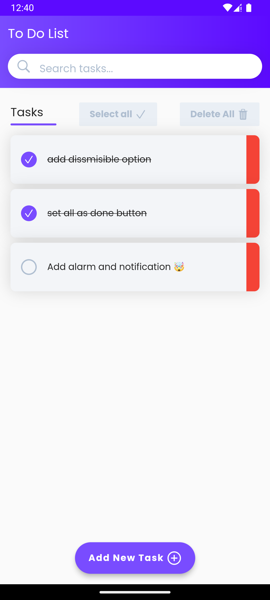
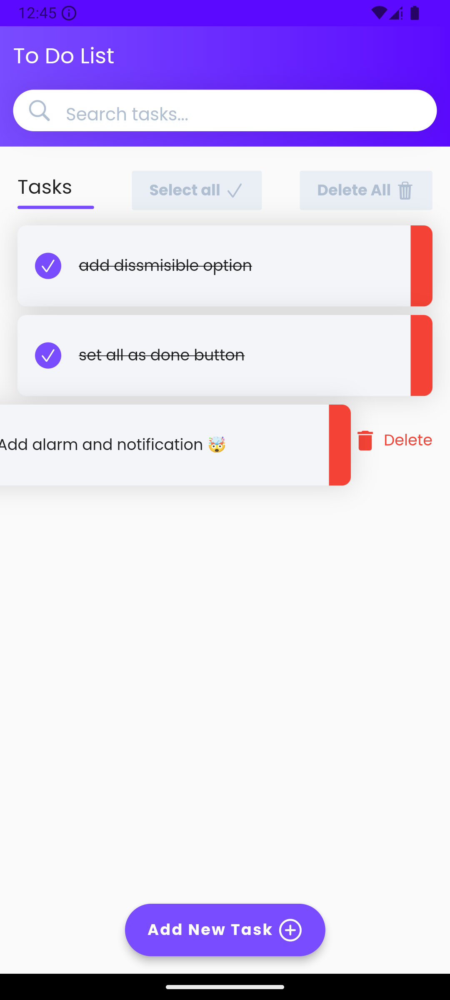
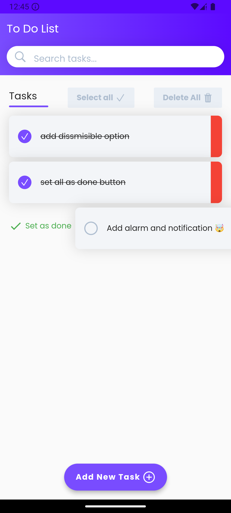

# Todo List App
A simple and intuitive Todo List app built with Flutter.

## Features
* Create and manage your todo tasks
* Prioritize tasks with high, normal, and low priority levels
* Hive and SharedPrefrences database to store tasks and states
* Mark tasks as completed
* Search for tasks by name
* Delete individual tasks or all tasks at once
* Select all or Unselect all tasks at once
* Swipe right to set as done or set as uncomplete task
* Swipe left to delete the task
* Hold on tasks to delete
* Edit existing tasks
* Empty state

## Screenshots

## Technical Details
* Built with Flutter 2.x
* Uses Hive for local storage
* Implements a simple and efficient data model using HiveObject and * HiveType
* Utilizes Flutter's Material Design for a native Android and iOS look and feel

## Getting Started
1. Clone the repository: git clone https://github.com/OracleMatrix/todo_list_app.git
2. Open the project in your preferred IDE (e.g. Android Studio, Visual Studio Code)
3. Run the app on an emulator or physical device: flutter run

## Contributing
Contributions are welcome! If you'd like to contribute to the app, please fork the repository and submit a pull request.
